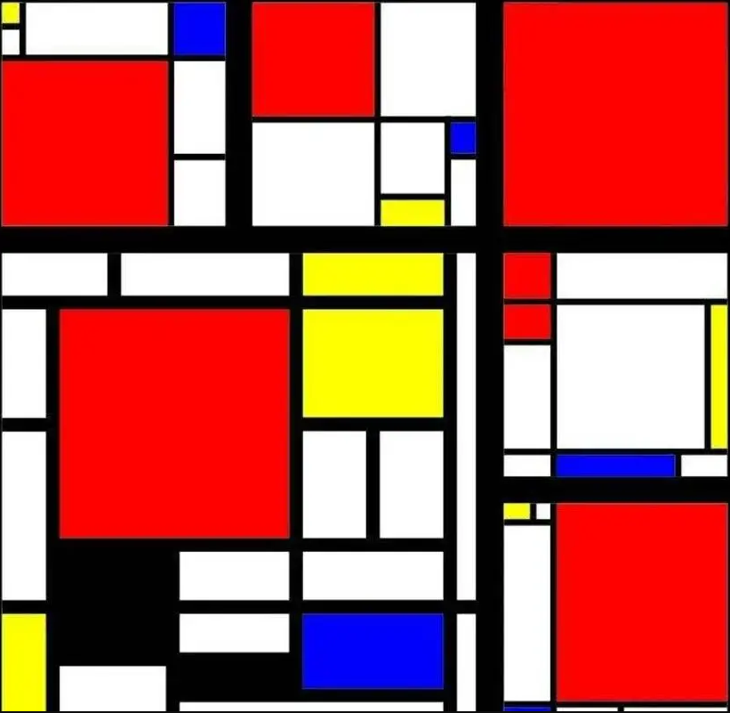
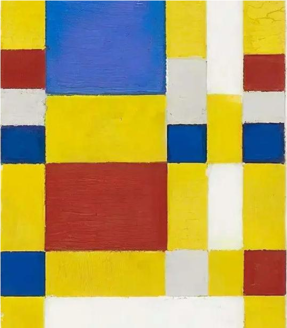
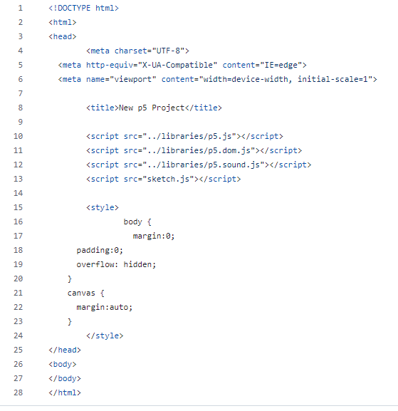
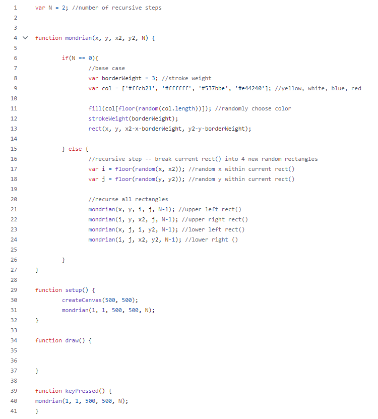

# yche0275_9103_tut02

# Quiz 8: Major Assignment Design Research

## Part 1: Imaging Technique Inspiration

For my assignment, I am inspired by the geometric style of Piet Mondrian, a pioneer in abstract art. His use of simple lines, shapes, and primary colors creates visually striking compositions. I aim to incorporate Mondrian's grid-based style into my project by generating abstract geometric patterns using rectangles, lines, and a limited color palette. This technique aligns well with the assignment's requirements to creatively use code to draw patterns.

### Images:

## Part 2: Coding Technique Exploration

To achieve a Mondrian-style composition in code, I plan to explore a grid generation technique using nested loops. The technique will allow me to create a grid of squares and rectangles that resemble Mondrian’s paintings. Each cell in the grid can be randomly assigned a primary color or left empty. By controlling the size and randomness, I can generate compositions dynamically. This coding technique is often used in generative art and can help create the desired abstract grid-based effect.

### Example Code and Link:
[Example](https://sofiagarcia.github.io/mondrian-generator/)

### Screenshot:

